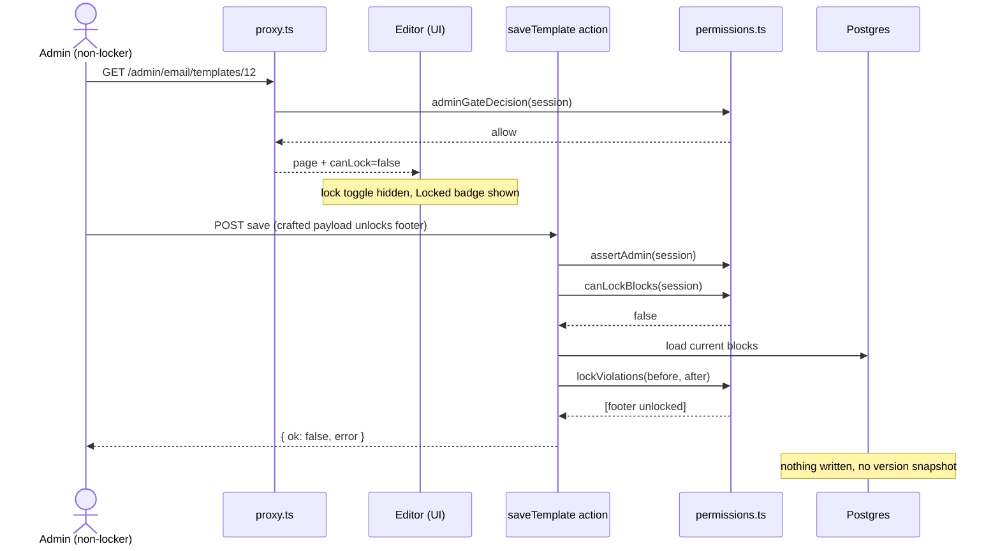

# Architecture

## Overview

Momo Audio is a Next.js 16 App Router application. Three principles shape the codebase:

1. **Server-first rendering.** Pages are async Server Components that fetch data on the server. Client JavaScript is limited to small leaf "islands" that genuinely need interactivity or animation.
2. **Feature-based structure.** Domain code (products, articles, timeline) lives in self-contained `features/*` folders, each exposing a public API through a barrel file.
3. **A single data seam.** Every feature reads through one `fetch*` layer that either serves local in-repo data or the Strapi CMS, decided by a single environment variable. Swapping the source changes nothing upstream.

---

## Rendering model: Server Components + client islands

### Server Components (the default)

All routes under `app/` are async Server Components. They:

- fetch data server-side through the feature `api` layer,
- wrap slow or below-the-fold content in `<Suspense>` with skeleton fallbacks,
- pass plain, already-validated data down as props.

Data fetching never happens in `useEffect`. It happens on the server, in the page or in a Server Component it renders.

### Client islands (the exception)

A component is marked `"use client"` **only** when it needs the browser: state, event handlers, or animation that depends on layout/mount. Examples:

- `components/primitives/reveal.tsx` — a small entrance-animation wrapper (respects `prefers-reduced-motion`).
- `components/primitives/search-field.tsx` — a debounced input that syncs a `q` URL param.
- `components/layout/page-hero.tsx` — mount-driven entrance animation.
- `features/checkout/components/cart-context.tsx`, `lib/auth/adapters/auth-context.tsx` — client context providers.

**Rule of thumb:** presentational content (cards, statements, specs) stays on the server. If such a component only needs an entrance animation, it wraps its markup in `<Reveal>` rather than becoming a client component itself. This keeps the client bundle small and pushes interactivity to the leaves. See [`conventions.md`](conventions.md).

---

## Directory layout

```
app/                     App Router routes, layouts, boundaries, API routes
  api/
    revalidate/          Strapi publish webhook -> revalidateTag
    preview/             Enter draft mode (inert until STRAPI_PREVIEW_SECRET set)
    exit-preview/        Leave draft mode
    auth/[...all]/       Better Auth's catch-all handler (lib/auth/adapters/instance.ts)
    stripe/webhook/      Stripe Checkout webhook -> finalizeCheckout (see below)
  (admin)/admin/         Admin dashboard: analytics, customers, orders, products,
                         email (campaigns/templates/messages/settings), theme,
                         settings, profile, docs. Gated by role, see lib/auth.
  error.tsx              Route-level error boundary
  global-error.tsx       Root-layout error boundary (self-contained HTML)
  not-found.tsx          404
  <route>/               about, account, articles, checkout, contact, onboarding,
                          products, sign-in, sign-up
  sitemap.ts robots.ts opengraph-image.tsx   SEO surfaces

features/                One folder per domain slice (100% feature-sliced)
  admin/ articles/ catalog/ checkout/ contact/ customers/ discount-codes/
  docs/ email/ orders/ products/ reviews/ settings/ showcase/ stock-alerts/ timeline/
  # features/stock-alerts: back-in-stock requests, restock emails, unsubscribe
  # features/showcase: demo seed, slide and carousel definitions for social assets
    components/          Slice UI (mostly Server Components + skeletons)
    lib/                 Four folders only: actions / data / domain / adapters
      actions/           Server actions (mutations); admin ones start with requireAdmin()
      data/              Reads and queries (server-only), the seam to the database or CMS
      domain/            Pure types, zod schemas and rules, unit tested
      adapters/          Talks to outside systems (Resend, Stripe, Strapi, Prisma)
    index.ts             The one public entry for client-safe imports
    server.ts            The one public entry for server-only imports

lib/                     Cross-cutting concerns only, never imports from features/
  auth/                  Better Auth, split into actions / data / domain / adapters
  strapi/                client.ts (transport), tags.ts (cache tags), media.ts
  data/                  Local in-repo content (fallback source)
  db/prisma.ts           Prisma client (Neon Postgres)
  stripe/                Stripe server + client helpers for embedded Checkout
  seo/ env.ts format.ts nav.ts utils.ts types.ts

components/              Shared UI (layout, home, contact, checkout, primitives, ui/*)
hooks/                   Shared React hooks
qa/                      Test suite (see docs/testing.md)
```

> The `features/*` list above only spells out `products`/`articles`/`timeline` in the data-seam section below because those are the ones currently wired to Strapi. `admin`, `checkout`, `customers`, `orders`, `email`, and `docs` are real, permanent features backed by Neon/Prisma + Better Auth + Stripe + Resend — not CMS-aware, and not part of the migration seam.

---

## The data seam

This is the most important part of the architecture. Each feature's `api/index.ts` exposes async functions (`fetchProducts`, `fetchProduct`, etc.) with **stable return types**. Internally each function branches on whether Strapi is configured:

```ts
const useStrapi = Boolean(env.STRAPI_API_URL)

export async function fetchProducts(): Promise<Product[]> {
  if (useStrapi) {
    return fetchStrapi("/api/products?populate=*", {
      parse: (data) => productSchema.array().parse(toEntries(data).map(mapStrapiProduct)),
      tags: [strapiTags.products.all()],
      revalidate,
    })
  }
  return productSchema.array().parse(getAllProducts()) // local data
}
```

Both branches end in the **same** `productSchema.parse(...)`, returning the **same** `Product` type. Pages, `generateStaticParams`, and Suspense boundaries never know or care which source produced the data.

### Layers in one read

```
Page (RSC)
  -> feature api  fetchProducts()          // decides source, attaches cache tags
     -> fetchStrapi()                       // transport: URL, token, timeout, retry, unwrap
        -> mapStrapiProduct()               // anti-corruption: CMS field names -> domain shape
           -> productSchema.parse()          // zod: the trust boundary
              -> Product                      // validated domain type
```

Responsibilities are deliberately separated:

- **`lib/strapi/client.ts` (`fetchStrapi`)** — the one hardened transport. Builds the URL, attaches the bearer token, times out slow requests (`AbortSignal.timeout`), retries transient network/5xx failures with backoff, and unwraps Strapi's `{ data, meta }` envelope. It does **not** validate — the caller passes `parse`.
- **`features/*/mappers.ts`** — the only place that knows Strapi's field names and media envelope. Tolerates both Strapi v5 (flat) and v4 (`{ id, attributes }`) shapes. If the CMS content-type drifts from the contract, it fails loudly here, at the boundary.
- **`features/*/schema`** — zod schemas that are the single source of truth for domain types (`type Product = z.infer<...>`).

Throwing on failure is intentional: the app's `error.tsx` / `not-found.tsx` boundaries catch it and render fallback UI.

---

## Caching & revalidation

CMS reads attach **cache tags** from `lib/strapi/tags.ts` via `fetch(..., { next: { tags } })`. The tag taxonomy is shared by the producer (fetch) and the consumer (webhook) so they can't drift:

- `products` / `product:<slug>`
- `articles` / `article:<slug>`
- `timeline`

When an editor publishes in Strapi, a webhook hits `POST /api/revalidate`, which maps the content-type `model` to its tags via `tagsForModel()` and calls `revalidateTag` for each — so only the affected pages refresh, instantly, without a redeploy. A background `revalidate` window (`STRAPI_REVALIDATE_SECONDS`) acts as a safety net.

---

## Email system (`features/email`)

Templates are stored as JSON block arrays in Postgres (Prisma) and rendered to HTML at send time. The slice keeps every editing rule in **pure, client-safe modules** so the editor and the tests share one implementation; Prisma access lives only in `repo.ts`, and mutations go through server actions in `admin-actions.ts` (which `revalidatePath` the templates routes).

| Module | Responsibility |
| --- | --- |
| `blocks/types.ts` | `EmailBlock` union: hero, heading, text, button, image, divider, spacer, list, callout, orderSummary, productPicks, lowStockItems. Any block may carry an optional `locked` flag. |
| `blocks/system-templates.ts` | Shipped templates (`order_confirmation`, `order_notification`, `personal_offer`, `shipping_update`, `refund_confirmation`, `low_stock`, `welcome`) plus `BLOCK_PRESETS`. These are the source for **Reset to original**. |
| `blocks/render.ts`, `blocks/sample.ts` | Block → email HTML, and sample data for previews. |
| `actions.ts` | Event senders: order confirmation, order notification (internal), low-stock alert, personal offer, refund confirmation, shipping confirmation. All no-op safely without `RESEND_API_KEY`. |
| `placeholders.ts` | Placeholder catalogue (`{{customer_name}}`, `{{order_number}}`, `{{shop_url}}`, …), the picker's groups, and `unknownPlaceholders()` / `suggestPlaceholder()` for typo hints. |
| `copy-quality.ts` | Subject spam-word flags and character-count tone for the copy hints. |
| `versions.ts` | Version-retention rules. `VERSION_KEEP = 50`: the original plus the newest are kept, older snapshots are pruned. |
| `sections.ts` | Saved sections: `pickSectionBlocks` (template order, ids stripped), `instantiateSection` (fresh ids per insert), `validateSectionInput` (`SECTION_NAME_MAX = 60`, `SECTION_MAX_BLOCKS = 20`). `SectionBlock` is a distributive `Omit` over the block union. |
| `starters.ts` | Starter gallery, grouped `essentials` / `seasonal` (Blank, Newsletter, Product launch, Sale, Announcement, Black Friday, Bank Holiday, Christmas). Hero images live in `public/email/`. |
| `locks.ts` | Locked-block rules: `updateIfUnlocked`, `removeIfUnlocked`, `canReorder` / `reorder` (nothing moves past a locked block), `insertionIndex` / `insertBlocks` (new content goes above the trailing locked run; appended if every block is locked). |

**Tables:** `email_templates` (current state + `version`), `email_template_versions` (immutable snapshot on every create / save / reset / restore, `reason` column, cascade-deleted with the template), `email_sections` (saved sections, blocks without ids). Block JSON is not schema-validated on the server, so new optional block fields (like `locked`) round-trip without a migration.

**Editor** (`features/admin/components/email/template-editor.tsx`): local undo/redo stack, Discard, Duplicate, an unsaved-changes guard on navigation, the placeholder picker, the saved-sections panel, the per-row lock toggle (locked rows render their fields inside a disabled `<fieldset>`), and `version-history.tsx` for preview/restore. `new-template-dialog.tsx` is the starter gallery.

### Authorization: defence in depth

Email admin access and block locking are enforced at three independent layers. Every layer calls the same **pure rules** in `lib/auth/domain/permissions.ts` (`adminGateDecision`, `assertAdmin`, `canLockBlocks`, unit-tested once), so a bug or bypass in one layer is caught by the next.

| Layer | Where | What it enforces |
| --- | --- | --- |
| 1. Route gate | `proxy.ts` (matcher `/admin/:path*`) | Signed-out visitors are redirected to `/sign-in?redirect=…`, non-admins to `/`. Non-GET requests (server-action POSTs) get `401`/`403` JSON instead of a redirect. |
| 2. Server actions (authoritative) | `features/email/lib/actions/admin.ts` | Every exported action starts with `await requireAdmin()`. `saveTemplate`, `resetTemplate` and `restoreVersion` also call `lockViolations(before, after)` and refuse the change unless `getServerCanLockBlocks()` is true. |
| 3. UI | `template-editor.tsx` via `canLock` prop from the server page | Non-lockers see a **Locked** badge instead of the toggle; `toggleLock` is a no-op. This is presentation only — never trusted. |

**Who can lock:** owners (`NEXT_PUBLIC_OWNER_EMAILS`, default `herman@adudev.co.uk`) plus any admin the owner grants rights to in **Admin → Settings → Permissions** (`/admin/settings/permissions`). Grants are stored in the `EmailLockRight` table and every grant or revoke writes a `PermissionAudit` row (`lib/auth/data/lock-rights-repo.ts`, `features/admin/lib/actions/permissions.ts`). The server-only `EMAIL_BLOCK_LOCKERS` variable is still honoured as a read-only fallback seed. The lookup is cached per request with React `cache()` and is never shipped to the browser. See ADR-011.

**Scheduled sends:** the cron route has no session, so the campaign-send logic lives in `features/email/lib/adapters/sending/campaign-send.ts` (`sendCampaign`). The cron route calls it directly; the admin action is a thin `requireAdmin()` wrapper around it.



---

## Boundaries

| File | Catches |
| --- | --- |
| `app/error.tsx` | Errors within a route subtree (client boundary, offers retry) |
| `app/global-error.tsx` | Errors in the root layout itself (ships its own `<html>/<body>`, dependency-free) |
| `app/not-found.tsx` | 404s and `notFound()` calls |
| `app/products/[slug]/loading.tsx`, `app/articles/[slug]/loading.tsx` | Route-level streaming fallbacks |

List pages stream through in-component `<Suspense>` + skeletons rather than a route-level `loading.tsx`.

---

## Component architecture: feature-slice over atomic

The codebase is **not** a classic atomic-design tree (atoms -> molecules -> organisms -> templates -> pages). It's roughly **feature-sliced**, with a thin, genuinely atomic layer underneath it:

| Layer | Where | What it holds |
| --- | --- | --- |
| Atoms (~ the "60%" that *is* atomic) | `components/primitives/`, `components/ui/` | Truly generic, feature-agnostic pieces: `Reveal`, `SearchField`, buttons, inputs, cards — shadcn/ui primitives and small animation wrappers. No domain knowledge. Reused everywhere. |
| Shared composites | `components/layout/`, `components/home/`, `components/checkout/`, `components/account/`, `components/auth/`, `components/contact/`, `components/docs/`, `components/scroll/`, `components/theme/`, `components/seo/` | Cross-feature UI composed from atoms (nav, page hero, scroll-driven sections). Still not domain-owned data — they render props passed in. |
| Feature slices (the "100%" organizing principle) | `features/products/`, `features/articles/`, `features/timeline/`, `features/checkout/`, `features/admin/`, `features/customers/`, `features/orders/`, `features/email/`, `features/docs/` | Each slice is vertically complete for its domain: `api/` (data access), `schema/` (zod + types), `lib/` (pure helpers), `components/` (feature-specific UI), and a single `index.ts` barrel. A slice owns everything about its domain end to end. |
| Routes | `app/**/page.tsx` | Compose feature-slice components + shared composites. Own layout and rendering strategy (see below), not business logic. |

**Why feature-slice, not atomic:** atomic design organizes by visual complexity (how composed a component is), which scales poorly once a domain (e.g. `products`) has its own data layer, schema, and mappers — those don't fit "atom/molecule/organism" at all. Organizing by feature keeps a domain's data access, validation, and UI next to each other and behind one barrel, so `app/products/*` never reaches into another feature's internals. The small atomic layer still exists at the bottom (`primitives/`, `ui/`) because generic, context-free pieces genuinely benefit from being shared and composed rather than duplicated per feature.

**Rule for new UI:** if it's generic and could apply to any feature, it's an atom in `components/primitives` or `components/ui`. If it's specific to a domain (renders a `Product`, an `Order`, a `Timeline` entry), it lives inside that feature's `components/` and is exported through the feature barrel — never promoted to the shared `components/` tree.

---

## Rendering strategies

Next.js 16 with Cache Components (`cacheComponents: true`, see `next.config.mjs`) is the runtime, so the project mixes SSG, SSR, ISR, and RSC streaming per-route rather than picking one global mode. There is no PPR flag set explicitly — Cache Components supersede it as the mechanism for mixing static and dynamic within a route.

| Strategy | How it's expressed here | Used for |
| --- | --- | --- |
| **RSC (default)** | Every `app/**/page.tsx` is an async Server Component. No `"use client"` unless a leaf genuinely needs the browser (see [Rendering model](#rendering-model-server-components--client-islands) above). | All routes, by default. |
| **SSG / static** | A route with no `dynamic`/`revalidate` export and no `cookies()`/`headers()` call is static: rendered at build time, served from cache. | Marketing/content pages with no per-request data: `about`, `privacy`, `terms`, `shipping`, `returns`, `warranty`. |
| **ISR (time-based revalidation)** | `export const revalidate = <seconds>` on a route, or `next: { revalidate }` on a `fetch`. `app/docs/[slug]/page.tsx` sets `revalidate = 300` with `dynamicParams = true` (statically known slugs prerender, new ones render on-demand and get cached). | `docs/[slug]`. Product/article/timeline pages get the same effect through cache-tagged fetches in the data seam (see [Caching & revalidation](#caching--revalidation)) rather than a page-level `revalidate` export. |
| **On-demand revalidation** | `revalidateTag()` from the Strapi publish webhook (`app/api/revalidate`), scoped by the tag taxonomy in `lib/strapi/tags.ts`. | Any CMS-backed content the instant an editor publishes, without waiting for the ISR window. |
| **SSR (force-dynamic)** | `export const dynamic = "force-dynamic"`. Used where the response must never be cached: it depends on the session/role, is a webhook, or reflects just-mutated state. | All `(admin)/admin/**` pages (session + role gated), `app/checkout/return` (reads a just-completed Checkout session), `app/api/stripe/webhook` (must run fresh every call, never cached). |
| **Client-side rendering** | `"use client"` islands only — never a whole route. | `features/checkout/components/cart-context.tsx`, `lib/auth/adapters/auth-context.tsx`, animation/interaction leaves in `components/primitives`. |

**Picking a strategy for a new route:**

1. Default to nothing (static/SSG) — no `dynamic` or `revalidate` export.
2. If the content changes on a schedule but tolerates staleness, add `export const revalidate = <seconds>`, or attach a cache tag in the data seam and revalidate it on demand.
3. If the page depends on the current session, role, or must reflect a mutation from the same request (e.g. post-checkout), use `export const dynamic = "force-dynamic"`. This is the pattern every admin page and the checkout return page already follow.
4. Never reach for full client-side rendering to solve a data-freshness problem — that's what SSR/ISR/on-demand revalidation are for. Client components are for interactivity, not data fetching.

---

## Security headers

`next.config.mjs` sets baseline response headers on all routes: `X-Content-Type-Options`, `Referrer-Policy`, `Strict-Transport-Security`, `X-Frame-Options: SAMEORIGIN`, `Permissions-Policy`, and a **report-only** CSP seeded with the origins the app calls (Supabase, Vercel Analytics). When Strapi is connected, add its origin to `connect-src` and then promote the CSP from report-only to enforcing. The v0 preview strips framing/CSP headers; they apply fully on the deployed site.
