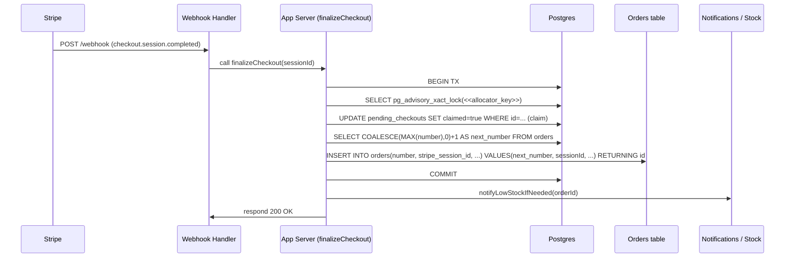

# Hand-off: fix/checkout-finalize-a11y

This document summarizes the changes made on branch `fix/checkout-finalize-a11y`, why they were made, tests run, and recommended next steps for the V0 developer taking over.

## Summary

- **Branch merged to `main`**: squash-merged as commit `b76f011`.
- **Goal:** make checkout finalization atomic and idempotent, centralize order-number allocation, restore SSG/ISR behavior for public pages, and fix a11y/CSP/dev tooling issues.

## Key Changes (files)

- `lib/orders/checkout-finalize.ts` — ensured finalize runs atomically inside a DB transaction; claims pending checkout rows and handles Stripe session idempotency.
- `lib/orders/db-actions.ts` — replaced local count-based order-number allocator with shared `nextOrderNumber(tx)` allocator (uses Postgres advisory lock).
- `app/layout.tsx` — removed server-side `fetchAppSession()` seeding at root; moved session fetch to client `AuthProvider` so public pages can be SSG/ISR.
- `qa/integration/checkout-finalize/finalize-checkout.test.ts` — added integration tests validating finalize behavior and idempotency.
- `qa/smoke/routes.spec.ts` — ignored noisy Vercel analytics console errors in smoke tests.
- `docs/environment.md` — clarified `POSTGRES_PRISMA_URL` and related env guidance.
- `next.config.mjs` — CSP updates report-only for Stripe & OSM.
- Misc: `package.json` scripts, `.gitignore` updates, and VS Code settings for Prisma extension pin.

## Why these changes

- Checkout finalize race: simultaneous webhooks or client retries could duplicate orders; making finalize atomic and idempotent prevents duplicates.
- Order-number collisions: count-based allocation is racy; a centralized allocator with an advisory lock ensures unique, monotonic order numbers across creation paths.
- Public page prerendering: awaiting a server session in root layout forced pages to be dynamic; moving session seeding client-side restores static/SSG/ISR classification for marketing pages.
- Cache invalidation: repo uses cache-tag based revalidation; Strapi webhook (when configured) calls `POST /api/revalidate` to `revalidateTag()` specific pages — this is preferred over global page-level ISR for CMS-driven content.

## Tests & Verification

- Local Vitest: all unit + integration passed (52/52 tests).
- Playwright (e2e + smoke): final local run passed (17/17 tests; smoke 6/6).
- Next.js production build: succeeded locally and generated route table with Static / SSG / Dynamic classifications. `app/docs/[slug]` shows `revalidate = 5m` (ISR) while most CMS-driven pages use cache-tagging.

## Important runtime/env notes

- `STRAPI_WEBHOOK_SECRET` — when Strapi is provisioned, set this in Vercel env; `POST /api/revalidate` expects header `Authorization: Bearer <STRAPI_WEBHOOK_SECRET>`. If unset, the route returns 501.
- `STRAPI_REVALIDATE_SECONDS` — optional safety-net revalidate window (recommend 300s) for fetches.
- DB allocator: order-number uses a DB advisory lock; no other configuration needed, but ensure Prisma/Postgres versions are compatible.

## Where to look (entry points)

- Finalization flow: `lib/orders/checkout-finalize.ts` — start here to understand how pending checkouts are claimed and orders created.
- Order creation for other flows: `lib/orders/db-actions.ts` — this now calls `nextOrderNumber(tx)`.
- Session/Auth: `app/layout.tsx` and `lib/auth/auth-context` (`AuthProvider`) handle client-side session seeding.
- Revalidation webhook: `app/api/revalidate/route.ts` and `lib/strapi/tags.ts` — mapping models to cache tags.

## Recommended next tasks for V0 developer

1. Provision Strapi and set `STRAPI_WEBHOOK_SECRET` and `STRAPI_REVALIDATE_SECONDS` in Vercel. Verify webhook calls `POST /api/revalidate` and that `revalidateTag()` runs for expected tags.
2. Review ESLint warnings (there are non-blocking warnings reported in CI). Consider a follow-up cleanup PR for developer ergonomics.
3. Add an automated GitHub Action to run Vitest + Playwright smoke on PRs to `main` (if not already configured) to catch regressions earlier.
4. Optionally create a small admin script to trigger `revalidateTag()` for manual testing while Strapi is not yet available.

## How to reproduce locally

1. Install dependencies: `pnpm install`.
2. Start dev: `pnpm dev:local` (ensure PORT free). For tests:
   - Unit/integration: `pnpm test` (Vitest)
   - Smoke/e2e: `pnpm run test:e2e` (Playwright)
3. Build production locally: `pnpm exec next build` to view route prerender table.

## Commit & PR history

- Branch: `fix/checkout-finalize-a11y` — grouped commits for features and fixes; squash-merged into `main` as `b76f011`.

## Location of this hand-off document

This file: `docs/hand-off/fix-checkout-finalize-a11y-hand-off.md` in the repository root.

If you want, I can also open a tidy PR that only contains docs (or move this file into a different path). Otherwise it is committed to `main`.

---

Questions or edits: tell me where you'd like additional detail (APIs, sequence diagrams, or `psql` queries used). I can expand this doc accordingly.

## Sequence Diagram



Replace `<<allocator_key>>` with a fixed integer chosen for the allocator (stable across processes).

## Tests (added and how to run)

- Integration: `qa/integration/checkout-finalize/finalize-checkout.test.ts` — validates:
  - pending checkout claim semantics (only one claim succeeds),
  - idempotent handling when the same Stripe session is processed twice,
  - order-number monotonicity under concurrent creates.
- Run tests locally:

```bash
pnpm install
pnpm test # Vitest (unit + integration)
pnpm run test:e2e # Playwright (smoke + e2e)
```

## DB SQL snippets

1. Transactional finalization pattern (Postgres)

```sql
BEGIN;
-- acquire transaction-scoped advisory lock
SELECT pg_advisory_xact_lock(123456789);

-- claim pending checkout(s) atomically
UPDATE pending_checkouts
SET claimed = true
WHERE id = $1 AND claimed = false
RETURNING id;

-- compute next order number (safe under the advisory lock)
SELECT COALESCE(MAX(number), 0) + 1 AS next_number FROM orders FOR SHARE;

-- insert order (fail-safe against duplicate stripe session)
INSERT INTO orders (number, stripe_session_id, total, created_at)
VALUES ($next_number, $session_id, $total, now())
ON CONFLICT (stripe_session_id) DO NOTHING
RETURNING id;

COMMIT;
```

2. Idempotent insert by unique constraint on `stripe_session_id`

```sql
-- ensure unique constraint exists
ALTER TABLE orders ADD CONSTRAINT orders_stripe_session_id_unique UNIQUE (stripe_session_id);

-- insertion that is safe to retry
INSERT INTO orders (number, stripe_session_id, total)
VALUES (123, 'sess_abc', 12900)
ON CONFLICT (stripe_session_id) DO NOTHING;
```

3. Handling duplicate attempts in application code

- If `INSERT` returns no rows (conflict), treat it as already-finalized and return success to the caller.

These snippets are intentionally minimal — adapt column names and sequencing to your schema.
